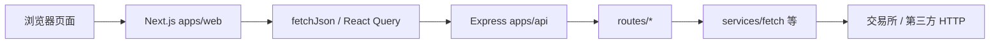
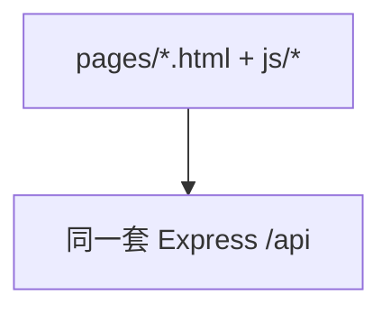

## ContractTradingTool（CTBox）

一个「**Next.js 网站（前端）** + **Node/Express API（后端）**」的合约数据看板。  
前端负责页面与交互；后端负责跨域请求第三方接口、做轻量缓存，并对出站请求做白名单等保护。

> **免责声明**：本项目仅用于学习与信息聚合展示，**不构成任何投资建议**。加密资产波动极大，请自行评估风险。

---

## 新手先看：脑子里只要记住两件事

1. **这是两个程序**  
   - **API**（`apps/api`）：跑在例如 `http://localhost:3000`，浏览器里的前端通过它去访问交易所等外网接口。  
   - **网站**（`apps/web`）：跑在例如 `http://localhost:3001`，是你看到的页面；它**不会**直接去连 Binance，而是请求上面的 API。

2. **环境变量各管各的**  
   - 后端：`apps/api/.env`（从 `.env.example` 复制）  
   - 前端：`apps/web/.env.local`（从 `.env.local.example` 复制），里面最重要的是 **`NEXT_PUBLIC_API_BASE_URL`**，要指到你的 API 地址。

更多名词在下面「术语与目录」里。

---

## 你会得到什么

- **首页**：入口与说明  
- **技术分析**（`/analysis`）：多指标聚合、综合评分、订单簿摘要等（React 页 + `apps/web/src/lib` 中的计算逻辑）  
- **市场监控**（`/monitor`）：涨跌、费率、清算、持仓、多空比等聚合展示  
- **事件合约**（`/event`）：基于指标的方向与推演辅助  
- **计算器**（`/calc`）：爆仓价、风险、止盈止损等试算  
- **直播**（`/live`）：列表与筛选（数据源需在 API 环境变量中配置或使用 `mock`）

根目录下的 **`js/`、`pages/`、`css/`** 为迁移期保留的**旧版静态站**，仍可用于对照和部分单测，日常开发以 **`apps/web`** 为准。

---

## 术语与目录（小白版）

| 名词 | 简单解释 |
|------|------------|
| Monorepo | 一个仓库里放多个子项目（这里是 `apps/api` + `apps/web`） |
| `NEXT_PUBLIC_*` | 写给浏览器看的配置，会打进前端包；**不要**把密钥写在这里 |
| `/api/*`（后端） | Express 提供的一组 HTTP 接口，例如 `/api/ticker` |
| `fetchJson`（前端） | `apps/web/src/lib/api.ts` 里封装的请求函数，会自动拼上 `NEXT_PUBLIC_API_BASE_URL` |
| React Query | 前端里做「请求、缓存、自动刷新」的库；监控页等会用到 |
| Primer | GitHub 风格的 UI 组件与样式；顶栏、主题等与它相关 |

**常用路径：**

| 路径 | 说明 |
|------|------|
| `apps/web/src/app/` | Next.js 页面与布局（`page.tsx` = 路由页面） |
| `apps/web/src/lib/` | 纯函数、API 封装、监控请求辅助等 |
| `apps/api/routes/` | 按功能拆分的路由（行情、合约、情绪、新闻、代理、直播） |
| `apps/api/services/` | 共享逻辑（如带重试的 `fetch`、内存缓存） |
| `apps/web/src/app/legacy.css` | 从旧站迁移的样式，与 Primer 桥接变量一起在布局里引入 |

**代码里哪里写了注释？**  
入口与全局行为主要在：`apps/web/src/app/layout.tsx`、`providers.tsx`、`AppChrome.tsx`，以及 `apps/web/src/lib/api.ts`、`queryKeys.ts`、`monitorApi.ts`；后端入口在 `apps/api/server.js`，出站请求在 `apps/api/services/fetch.js`。跟着这些文件读，能串起整条链路。

---

## 环境要求

- **Node.js**：建议 `20.x` / `22.x` / `23.x`（LTS 更省心）  
- **npm**：随 Node 安装即可  

---

## 快速开始

### 1）安装依赖（在仓库根目录）

```bash
npm install
```

### 2）启动后端 API（必需）

```bash
npm run dev:api
```

首次使用请复制环境变量模板：

```bash
cp apps/api/.env.example apps/api/.env
```

默认端口 **3000**。浏览器可访问：

- `http://localhost:3000/ping` → 应返回 `{ ok: true, ... }`  
- `http://localhost:3000/api/ticker?symbol=BTCUSDT` → 行情 JSON  

### 3）启动前端（必需）

```bash
cp apps/web/.env.local.example apps/web/.env.local
```

编辑 `apps/web/.env.local`，例如本地开发：

```env
NEXT_PUBLIC_API_BASE_URL=http://localhost:3000
```

然后：

```bash
npm run dev:web
```

终端里会打印端口（常见为 **3000** 或 **3001**），用浏览器打开对应地址即可。

### 4）运行测试

```bash
npm run test:api
npm run test:web
```

根目录的 `npm run test:web` 等价于 `npm --workspace apps/web test`（Vitest + 部分 legacy 的 `node:test`）。

### 5）代码检查（前端 ESLint）

```bash
npm run lint
```

（在根目录执行，会检查 `apps/web`。）

---

## 单元测试与覆盖率

```bash
npm run test:api
npm run test:web
npm run test:api:cov
```

`test:api:cov` 会生成覆盖率报告（含 `coverage/lcov-report`）。

**当前测试大致覆盖**（节选）：缓存 TTL、`services/fetch` 重试与缓存、各路由在错误/白名单下的行为、`server` 集成健康检查等；前端另有 `apps/web/src/lib` 的 Vitest 用例。细节以 `apps/api/tests`、`apps/web/tests` 为准。

---

## 数据怎么流动（概念图）

### 当前 Next.js 站点（日常开发）



### 旧版静态页（仅对照，可选）



---

## 核心业务逻辑在哪（输入 → 输出）

- **分析页（React）**  
  - 拉数：`apps/web/src/app/analysis/page.tsx` 通过 `fetchJson` / `fetchJsonOptional` 调后端。  
  - 指标：沿用 `apps/web/src/lib/legacy/indicators.js` 中的 `analyzeAll`（与旧 `js/indicators.js` 同源思路）。  
  - 展示与派生：`apps/web/src/lib/analysisFlow.ts`、`analysisSentimentTags.ts` 等。

- **后端路由**  
  - `routes/market.js`：K 线、ticker、深度等  
  - `routes/futures.js`：资金费率、持仓、多空、强平  
  - `routes/sentiment.js`：情绪相关代理  
  - `routes/news.js`：RSS 聚合  
  - `routes/proxy.js`：通用 JSON 代理（**必须配置白名单域名**）  
  - `routes/live.js`：直播列表（依赖 `LIVE_*` 环境变量或 `mock`）

---

## 环境变量（API）

从 `apps/api/.env.example` 复制为 `apps/api/.env`。常用项：

| 变量 | 作用 |
|------|------|
| `PORT` | 监听端口，默认 `3000` |
| `PROXY_ALLOWED_DOMAINS` | `/api/proxy` 允许的域名，逗号分隔 |
| `FETCH_TIMEOUT_MS` / `FETCH_MAX_RETRIES` | 出站请求超时与重试（见 `.env.example` 注释） |
| `HTTP_PROXY` / `HTTPS_PROXY` / `ALL_PROXY` | 本机需要代理访问外网时填写 |
| `NEWS_RSS_SOURCES` | 新闻源 JSON 数组字符串 |
| `LIVE_*` | 直播抓取与解析；`LIVE_PROVIDER=mock` 可本地演示 |

## 环境变量（Web）

| 变量 | 作用 |
|------|------|
| `NEXT_PUBLIC_API_BASE_URL` | 浏览器访问的后端根地址，**不要**末尾多余 `/` |

---

## 部署（前后端分离）

### 前端（例如 Vercel）

- **Root Directory**：`apps/web`  
- **环境变量**：`NEXT_PUBLIC_API_BASE_URL` = 你的 API 公网地址（如 `https://ctbox-api.example.com`）  

### 后端（任意 Node 托管）

- 工作目录：`apps/api`  
- 启动：`npm start`  
- 至少配置：`PORT`（若平台未注入）、`PROXY_ALLOWED_DOMAINS`  

自检：`GET /ping`、`GET /api/ticker?symbol=BTCUSDT`。

---

## 上线前检查清单

- [ ] `apps/api/.env` 已配置且 **`PROXY_ALLOWED_DOMAINS`** 包含实际要代理的域名  
- [ ] `apps/web` 生产环境已设置 **`NEXT_PUBLIC_API_BASE_URL`**  
- [ ] 若使用新闻/直播：`NEWS_RSS_SOURCES` 可解析；`LIVE_*` 按目标站配置或使用 `mock`  

---

## 已知限制与可改进点

- **外网与限流**：交易所等接口可能限频或变更字段，页面需容错（本项目多处已做空数据/降级处理）。  
- **代理安全**：`/api/proxy` 依赖白名单，**切勿**在生产放开任意域名。  
- **Legacy 目录**：`js/`、`pages/` 与根目录旧 `css/` 仅作迁移参照，新功能请写在 `apps/web`。  
- **根目录 `npm run lint`**：仅配置为检查 `apps/web`；API 侧以 `node --test` 为主。  

若你希望补充：统一错误码、更细的 E2E 测试、直播源适配文档等，可在 Issue 里列需求。

---

## FAQ

- **`npm install` 报错**  
  换 Node LTS（20/22），删除各应用下 `node_modules` 后重装。

- **页面一直转圈或没有数据**  
  确认 API 已启动，且 `apps/web/.env.local` 里 `NEXT_PUBLIC_API_BASE_URL` 与 API 地址一致（含 `http://`）。

- **`/api/proxy` 提示 domain not allowed**  
  在 `apps/api/.env` 的 `PROXY_ALLOWED_DOMAINS` 中加入目标主机名，或改用已有的一手接口（如 `/api/ticker`）。

- **想和旧静态站对照**  
  看仓库根目录 `pages/`、`js/`，样式对照 `css/style.css` 与 `apps/web/src/app/legacy.css`。

---

## 许可证与致谢

使用第三方公开接口时请遵守各平台服务条款。UI 使用 [Primer](https://primer.style/) 与 GitHub 设计语言相关的开源组件。
